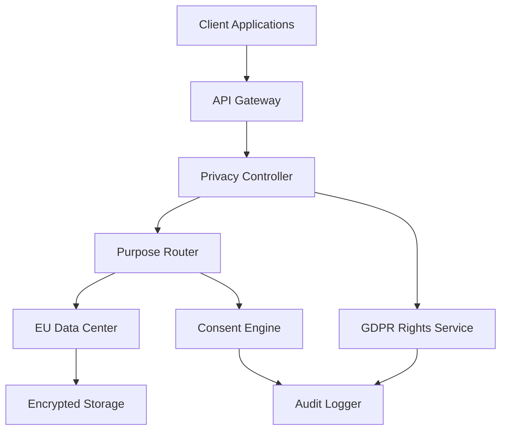

# GDPR-Native Architecture: Privacy by Design for Developer Productivity Platform

## Overview

GDPR-native architecture means designing your system from the ground up with GDPR principles built into the core technical architecture, rather than adding compliance features as an afterthought. This document outlines the technical implementation of privacy-by-design principles for a European developer productivity platform.

## Core GDPR Principles & Technical Implementation

### 1. Data Minimization by Design

**Principle**: Only collect data that's strictly necessary for functionality

**Technical Implementation**:
```sql
-- Database schema with purpose-driven data collection
CREATE TABLE user_activity (
    id UUID PRIMARY KEY,
    user_id UUID,
    data JSONB, -- Minimal data structure
    purpose VARCHAR(50) NOT NULL, -- 'analytics', 'billing', 'product_improvement'
    legal_basis VARCHAR(50) NOT NULL, -- 'consent', 'contract', 'legitimate_interest'
    consent_id UUID REFERENCES consent_records(id),
    retention_until TIMESTAMP NOT NULL, -- Automatic deletion date
    data_sensitivity VARCHAR(20) DEFAULT 'low', -- 'low', 'medium', 'high'
    created_at TIMESTAMP DEFAULT NOW(),
    updated_at TIMESTAMP DEFAULT NOW()
);

-- Automatic data purging
CREATE OR REPLACE FUNCTION purge_expired_data()
RETURNS void AS $$
BEGIN
    DELETE FROM user_activity WHERE retention_until < NOW();
    DELETE FROM user_sessions WHERE expires_at < NOW();
    DELETE FROM audit_logs WHERE created_at < NOW() - INTERVAL '7 years';
END;
$$ LANGUAGE plpgsql;

-- Schedule automatic purging
SELECT cron.schedule('purge-expired-data', '0 2 * * *', 'SELECT purge_expired_data();');
```

**Application Layer**:
```typescript
interface DataCollectionConfig {
  purpose: DataPurpose;
  retention: RetentionPeriod;
  legalBasis: LegalBasis;
  minimumDataSet: string[];
}

class PrivacyAwareCollector {
  collect(data: any, config: DataCollectionConfig): void {
    // Only collect fields specified in minimumDataSet
    const minimalData = this.extractMinimalData(data, config.minimumDataSet);

    // Tag with GDPR metadata
    const enrichedData = {
      ...minimalData,
      purpose: config.purpose,
      legalBasis: config.legalBasis,
      retentionUntil: this.calculateRetention(config.retention)
    };

    this.store(enrichedData);
  }
}
```

### 2. Purpose Limitation Architecture

**Principle**: Data tagged with specific purposes at collection, technical enforcement prevents misuse

**Database Design**:
```sql
-- Purpose-driven data access control
CREATE TABLE data_purposes (
    id UUID PRIMARY KEY,
    name VARCHAR(50) UNIQUE NOT NULL,
    description TEXT,
    legal_basis VARCHAR(50) NOT NULL,
    retention_period INTERVAL NOT NULL,
    data_categories TEXT[] NOT NULL,
    created_at TIMESTAMP DEFAULT NOW()
);

-- Insert standard purposes
INSERT INTO data_purposes VALUES
('analytics', 'Product analytics and improvement', 'legitimate_interest', '2 years', ARRAY['usage_metrics', 'performance_data']),
('billing', 'Payment processing and invoicing', 'contract', '7 years', ARRAY['billing_info', 'usage_stats']),
('support', 'Customer support and troubleshooting', 'legitimate_interest', '3 years', ARRAY['support_tickets', 'user_data']);

-- Row-level security for purpose enforcement
CREATE POLICY purpose_based_access ON user_activity
    FOR SELECT USING (
        purpose = current_setting('app.data_purpose', true) OR
        has_role('data_processor')
    );

ALTER TABLE user_activity ENABLE ROW LEVEL SECURITY;
```

**API Implementation**:
```typescript
class PurposeAwareAPI {
  constructor(private purpose: DataPurpose) {}

  async getUserData(userId: string): Promise<UserData> {
    // Set purpose context for database queries
    await this.db.query('SET app.data_purpose = $1', [this.purpose]);

    // Only returns data for specified purpose
    return this.db.query('SELECT * FROM user_activity WHERE user_id = $1', [userId]);
  }
}

// Usage
const analyticsAPI = new PurposeAwareAPI('analytics');
const billingAPI = new PurposeAwareAPI('billing');

// analyticsAPI can only access analytics data
// billingAPI can only access billing data
```

### 3. Built-in Consent Management

**Principle**: Granular consent tracking with technical enforcement

**Consent Schema**:
```sql
CREATE TABLE consent_records (
    id UUID PRIMARY KEY,
    user_id UUID NOT NULL,
    purpose VARCHAR(50) NOT NULL,
    granted BOOLEAN NOT NULL,
    version INTEGER NOT NULL,
    granted_at TIMESTAMP,
    withdrawn_at TIMESTAMP,
    ip_address INET,
    user_agent TEXT,
    method VARCHAR(20), -- 'explicit', 'implied', 'withdrawn'
    metadata JSONB,
    created_at TIMESTAMP DEFAULT NOW()
);

CREATE TABLE consent_purposes (
    id UUID PRIMARY KEY,
    name VARCHAR(50) UNIQUE NOT NULL,
    description TEXT NOT NULL,
    required BOOLEAN DEFAULT FALSE,
    category VARCHAR(50), -- 'functional', 'analytics', 'marketing'
    version INTEGER DEFAULT 1,
    created_at TIMESTAMP DEFAULT NOW()
);

-- Consent-driven feature flags
CREATE OR REPLACE FUNCTION has_consent(user_uuid UUID, purpose_name VARCHAR)
RETURNS BOOLEAN AS $$
BEGIN
    RETURN EXISTS (
        SELECT 1 FROM consent_records cr
        JOIN consent_purposes cp ON cr.purpose = cp.name
        WHERE cr.user_id = user_uuid
        AND cr.purpose = purpose_name
        AND cr.granted = TRUE
        AND cr.withdrawn_at IS NULL
    );
END;
$$ LANGUAGE plpgsql;
```

**Application Implementation**:
```typescript
class ConsentManager {
  async checkConsent(userId: string, purpose: string): Promise<boolean> {
    const result = await this.db.query(
      'SELECT has_consent($1, $2) as has_consent',
      [userId, purpose]
    );
    return result.rows[0].has_consent;
  }

  async grantConsent(userId: string, purposes: ConsentGrant[]): Promise<void> {
    for (const grant of purposes) {
      await this.db.query(`
        INSERT INTO consent_records (user_id, purpose, granted, version, granted_at, method, metadata)
        VALUES ($1, $2, $3, $4, NOW(), $5, $6)
      `, [userId, grant.purpose, true, grant.version, grant.method, grant.metadata]);
    }
  }

  async withdrawConsent(userId: string, purpose: string): Promise<void> {
    // Mark consent as withdrawn
    await this.db.query(`
      UPDATE consent_records
      SET withdrawn_at = NOW()
      WHERE user_id = $1 AND purpose = $2 AND withdrawn_at IS NULL
    `, [userId, purpose]);

    // Trigger data deletion for this purpose
    await this.deleteDataForPurpose(userId, purpose);
  }
}

// Feature activation based on consent
class FeatureGate {
  async isEnabled(userId: string, feature: string): Promise<boolean> {
    const requiredPurpose = this.getRequiredPurpose(feature);
    return this.consentManager.checkConsent(userId, requiredPurpose);
  }
}
```

### 4. Data Subject Rights Implementation

**Technical Implementation of GDPR Rights**:

```typescript
class GDPRRightsService {

  // Right to Access (Article 15)
  async generateDataExport(userId: string): Promise<DataExport> {
    const userData = await this.db.query(`
      SELECT
        table_name,
        json_agg(row_to_json(t)) as data
      FROM (
        SELECT * FROM user_activity WHERE user_id = $1
        UNION ALL
        SELECT * FROM user_sessions WHERE user_id = $1
        UNION ALL
        SELECT * FROM consent_records WHERE user_id = $1
      ) t
      GROUP BY table_name
    `, [userId]);

    return {
      exportedAt: new Date(),
      userId,
      data: userData.rows,
      format: 'JSON',
      completeness: 'complete'
    };
  }

  // Right to Rectification (Article 16)
  async updateUserData(userId: string, updates: DataUpdate[]): Promise<void> {
    for (const update of updates) {
      await this.db.query(`
        UPDATE ${update.table}
        SET ${update.field} = $1, updated_at = NOW()
        WHERE user_id = $2
      `, [update.newValue, userId]);

      // Log the rectification
      await this.auditLog.log('data_rectification', {
        userId,
        table: update.table,
        field: update.field,
        oldValue: update.oldValue,
        newValue: update.newValue
      });
    }
  }

  // Right to Erasure (Article 17)
  async deleteUserData(userId: string, scope: 'complete' | 'purpose'[] = 'complete'): Promise<void> {
    if (scope === 'complete') {
      // Complete data deletion
      await this.db.transaction(async (tx) => {
        await tx.query('DELETE FROM user_activity WHERE user_id = $1', [userId]);
        await tx.query('DELETE FROM user_sessions WHERE user_id = $1', [userId]);
        await tx.query('DELETE FROM consent_records WHERE user_id = $1', [userId]);
        await tx.query('DELETE FROM users WHERE id = $1', [userId]);
      });
    } else {
      // Purpose-specific deletion
      for (const purpose of scope) {
        await this.db.query(
          'DELETE FROM user_activity WHERE user_id = $1 AND purpose = $2',
          [userId, purpose]
        );
      }
    }

    // Log the erasure
    await this.auditLog.log('data_erasure', { userId, scope });
  }

  // Right to Data Portability (Article 20)
  async generatePortableExport(userId: string): Promise<PortableData> {
    const data = await this.generateDataExport(userId);

    return {
      ...data,
      format: 'structured',
      machineReadable: true,
      standardFormat: 'JSON-LD',
      importInstructions: this.generateImportGuide()
    };
  }

  // Right to Object (Article 21)
  async objectToProcessing(userId: string, purposes: string[]): Promise<void> {
    for (const purpose of purposes) {
      await this.consentManager.withdrawConsent(userId, purpose);

      // Stop all processing for this purpose
      await this.processingEngine.stopProcessing(userId, purpose);
    }
  }
}
```

### 5. Data Sovereignty Controls

**Regional Data Residency**:
```typescript
interface DataResidencyConfig {
  region: 'EU' | 'US' | 'APAC';
  allowedCountries: string[];
  datacenters: string[];
  transferRestrictions: string[];
}

class RegionalDataManager {
  private configs: Map<string, DataResidencyConfig> = new Map([
    ['EU', {
      region: 'EU',
      allowedCountries: ['DE', 'FR', 'NL', 'IE', 'FI', 'SE'],
      datacenters: ['frankfurt-1', 'amsterdam-1', 'dublin-1'],
      transferRestrictions: ['no_us_transfer', 'adequacy_required']
    }]
  ]);

  async storeData(userId: string, data: any): Promise<void> {
    const userRegion = await this.getUserRegion(userId);
    const config = this.configs.get(userRegion);

    if (!config) {
      throw new Error(`No configuration for region: ${userRegion}`);
    }

    const datacenter = this.selectDatacenter(config.datacenters);
    const storage = this.getRegionalStorage(datacenter);

    await storage.store(data);
  }

  async transferData(userId: string, targetRegion: string): Promise<boolean> {
    const userRegion = await this.getUserRegion(userId);
    const sourceConfig = this.configs.get(userRegion);

    // Check transfer restrictions
    if (sourceConfig?.transferRestrictions.includes('no_us_transfer') && targetRegion === 'US') {
      throw new GDPRViolationError('Transfer to US not permitted for EU users');
    }

    return this.performTransfer(userId, targetRegion);
  }
}
```

### 6. Privacy Impact Assessment (DPIA) Integration

**Automated Risk Assessment**:
```typescript
interface PrivacyRisk {
  level: 'low' | 'medium' | 'high' | 'very_high';
  category: 'data_volume' | 'sensitivity' | 'purpose' | 'transfer';
  description: string;
  mitigation: string[];
}

class DPIAEngine {
  assessProcessingRisk(processing: DataProcessing): PrivacyRisk[] {
    const risks: PrivacyRisk[] = [];

    // Volume-based risk
    if (processing.recordCount > 1000000) {
      risks.push({
        level: 'high',
        category: 'data_volume',
        description: 'Large-scale processing of personal data',
        mitigation: ['implement_anonymization', 'reduce_data_collection']
      });
    }

    // Sensitivity-based risk
    if (processing.dataCategories.includes('special_category')) {
      risks.push({
        level: 'very_high',
        category: 'sensitivity',
        description: 'Processing of special category data',
        mitigation: ['explicit_consent', 'additional_safeguards']
      });
    }

    // Cross-border transfer risk
    if (processing.crossBorderTransfer) {
      risks.push({
        level: 'medium',
        category: 'transfer',
        description: 'International data transfer',
        mitigation: ['adequacy_decision', 'standard_contractual_clauses']
      });
    }

    return risks;
  }

  async triggerDPIA(processing: DataProcessing): Promise<boolean> {
    const risks = this.assessProcessingRisk(processing);
    const highRisks = risks.filter(r => r.level === 'high' || r.level === 'very_high');

    if (highRisks.length > 0) {
      await this.createDPIARecord(processing, risks);
      await this.notifyDataProtectionOfficer(processing, highRisks);
      return true;
    }

    return false;
  }
}
```

### 7. Audit and Compliance Monitoring

**Comprehensive Audit Trail**:
```sql
CREATE TABLE gdpr_audit_log (
    id UUID PRIMARY KEY,
    user_id UUID,
    action VARCHAR(50) NOT NULL, -- 'data_access', 'consent_change', 'data_deletion'
    purpose VARCHAR(50),
    legal_basis VARCHAR(50),
    data_categories TEXT[],
    actor_id UUID, -- Who performed the action
    actor_type VARCHAR(20), -- 'user', 'system', 'admin'
    ip_address INET,
    user_agent TEXT,
    metadata JSONB,
    created_at TIMESTAMP DEFAULT NOW()
);

-- Compliance monitoring views
CREATE VIEW compliance_dashboard AS
SELECT
    DATE_TRUNC('day', created_at) as date,
    action,
    COUNT(*) as count,
    COUNT(DISTINCT user_id) as unique_users
FROM gdpr_audit_log
WHERE created_at >= NOW() - INTERVAL '30 days'
GROUP BY DATE_TRUNC('day', created_at), action
ORDER BY date DESC;
```

**Automated Compliance Checks**:
```typescript
class ComplianceMonitor {
  async runDailyChecks(): Promise<ComplianceReport> {
    const checks = await Promise.all([
      this.checkDataRetention(),
      this.checkConsentValidity(),
      this.checkCrossBorderTransfers(),
      this.checkProcessingLegality(),
      this.checkSubjectRightsResponse()
    ]);

    const violations = checks.filter(check => !check.compliant);

    if (violations.length > 0) {
      await this.alertComplianceTeam(violations);
    }

    return {
      date: new Date(),
      checks,
      compliant: violations.length === 0,
      violations
    };
  }

  private async checkDataRetention(): Promise<ComplianceCheck> {
    const expiredData = await this.db.query(`
      SELECT COUNT(*) as count
      FROM user_activity
      WHERE retention_until < NOW()
    `);

    return {
      name: 'data_retention',
      compliant: expiredData.rows[0].count === 0,
      details: `${expiredData.rows[0].count} records past retention period`
    };
  }
}
```

## Technical Architecture Overview

### System Components



### Data Flow with Privacy Controls

1. **Data Collection**: All data tagged with purpose and legal basis
2. **Purpose Routing**: Data routed to appropriate processing systems
3. **Consent Check**: Processing blocked if consent withdrawn
4. **Regional Storage**: Data stored in appropriate jurisdiction
5. **Audit Logging**: All access and processing logged
6. **Automated Cleanup**: Expired data automatically purged

## Implementation Benefits

### For Developers
- **Transparent Privacy**: Clear data usage and retention policies
- **User Control**: Self-service data management and privacy controls
- **Trust Building**: Open-source privacy components for auditability

### For Enterprises
- **Compliance Automation**: Reduced manual compliance overhead
- **Audit Ready**: Complete audit trails and documentation
- **Risk Mitigation**: Technical controls prevent violations
- **Due Diligence**: Comprehensive privacy documentation

### For Regulators
- **Transparency**: Clear technical implementation of GDPR principles
- **Accountability**: Comprehensive audit trails and compliance monitoring
- **Proactive Compliance**: Privacy by design rather than reactive measures

## Conclusion

GDPR-native architecture transforms privacy compliance from a cost center into a competitive advantage. By embedding privacy controls into the core technical architecture, we create a system that:

1. **Prevents violations by design** rather than hoping to catch them after the fact
2. **Empowers users** with self-service privacy controls
3. **Reduces compliance overhead** through automation
4. **Builds trust** through transparency and technical guarantees
5. **Enables European market entry** with confidence

This approach positions the platform as the privacy-first choice for European developers and enterprises, creating a strong competitive moat that's difficult for US-based competitors to replicate.